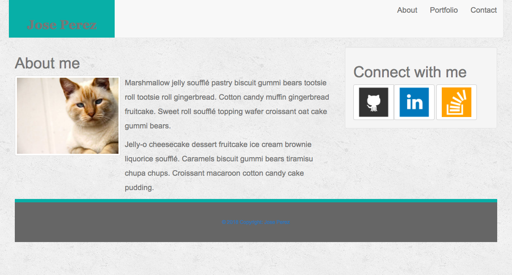
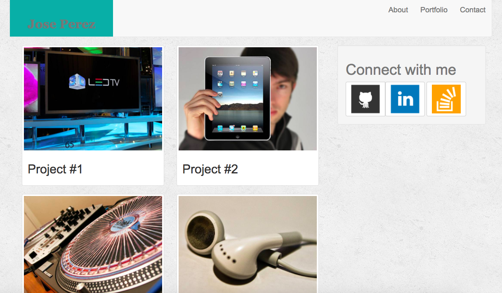
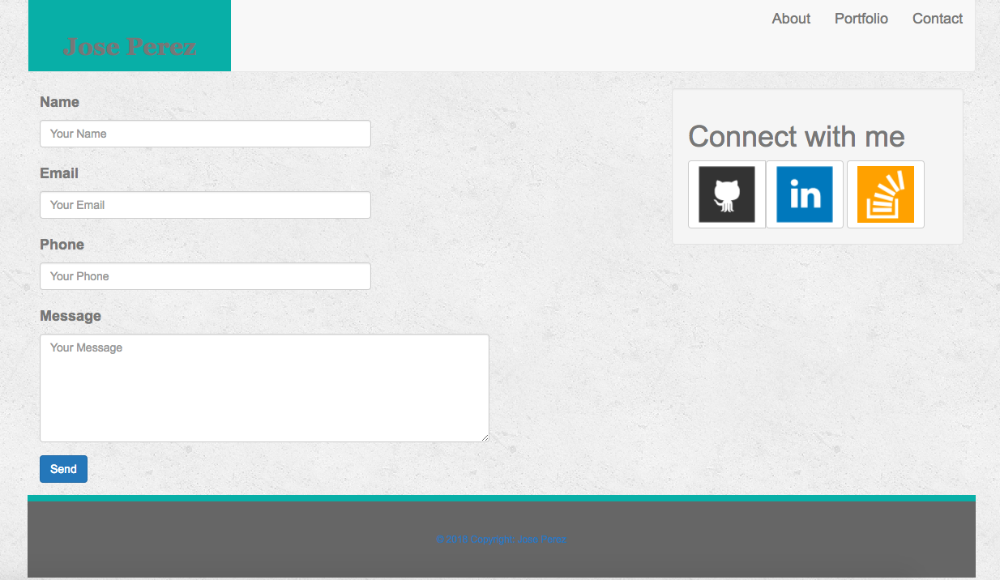

# Bootstraps-Portfolio

This is a basic portfolio with and index, contact and portfolio page. 

## Getting Started

Download the repo to your computer and then open the index file using your chrome browser.

## Built With

* [Bootstraps](http://bootstrapdocs.com/v3.3.6/docs/getting-started/) - Is an open source toolkit for developing with HTML, CSS, and JS.
* [CSS](https://www.w3schools.com/css/) - Is a language that describes the style of an HTML document. CSS describes how HTML elements should be displayed.
* [HTML](https://www.w3schools.com/css/) - Is the standard markup language for creating Web pages. HTML stands for Hyper Text Markup Language

## Author

* **Jose Perez** - *Initial work* - [PurpleBooth](https://github.com/PurpleBooth)

## License

This project is licensed under the MIT License - see the [LICENSE.md](LICENSE.md) file for details

